# Bengaluru Traffic Control Room

A map-based control room for Bengaluru traffic operations: the whole area, the Urban city (North, East, Central, West, South regions, 53 police-station territories) and the outer Rural area (9 taluk units), on real OpenStreetMap roads. Three admin-controlled map views, role-scoped actions, road-closure planner, works-clash analysis, English and Kannada. A separate Admin site manages users, data connectors, API keys, AI budget, system checks and audit. Built for Google Cloud, sized for a proof of concept.

> **Honest status.** Traffic state is **modelled** (BPR link times, assignment, gravity demand) and is labelled "LIVE (modelled)" only when calibrated against probe observations. Crash statistics are real (BTP 2018–2025 via OpenCity). Station territories are approximate (Voronoi, clipped to the boundary). The 9 outer units are taluks, not police stations, and have no crash data. Kannada text needs native review. Automated tests run against in-memory and mock backends, not real Firestore, Vertex AI, Secret Manager, Firebase Auth or Cloud Run; see [Validation status](#validation-status).

## Why this exists

Dashboards over monthly crash data are easy to rebuild in a BI tool. What a city traffic command lacks is a **spatial, role-scoped decision tool**: one map where the Commissioner sees the whole city, each DCP sees a region, each station sees its own territory, and everyone can ask "what happens if we close this road, and when is the least bad time?" This repo is a proof of concept of that tool. It deliberately does not duplicate camera analytics, e-challan or ANPR systems; it connects to them.

## Scope

**In scope (built):**
- One map, 62 areas: 53 police-station territories in five Urban regions plus 9 outer taluk units (Nelamangala, Doddaballapura, Devanahalli, Hoskote, Anekal, Bengaluru South/North/East, Yelahanka). Scope chips (keys 1 to 8): Whole area, Urban, North, East, Central, West, South, Rural. Choosing Urban or Rural dims the other.
- About 15,000 routable road segments (motorway to secondary) and about 117,000 drawn segments including tertiary roads and, as you zoom in, residential streets in the city and the link zone around it. Outer roads connect to city roads.
- Three map views with a legend and a "use it to" hint each: **Live traffic** (modelled congestion), **Crash hotspots** (2025 fatal crashes per station area), **Area speed** (average modelled speed per area).
- Admin control of the map without a deploy: default view, which roles see which view, which data layers exist (local roads, stations, incidents, works, Google live traffic), speed-colour thresholds and the crash shading scale.
- Role-scoped access: Commissioner (city), DCP (one region), station (own station, sees its region), viewer (read only), admin.
- Action workflow (new, acknowledged, in progress, done) with escalation and verification timers.
- Road-closure and works planner that quantifies city-wide impact by time of day, plus works-clash detection.
- Replay of a typical day in the browser; English and Kannada.
- Admin site for users, stations and territories, connectors, API keys, probes, works, map views and layers, AI budget, system checks, audit log.
- Cost-bounded AI (Gemini tiers, quotas, caches, kill switch) and Terraform for the full GCP stack.

**Out of scope (not built):** camera or video analytics, e-challan, ANPR processing, citizen-facing features, mobile apps, any integration with real police systems (the connector framework is ready; access is not).

## Screens

All images are real screenshots of the running app (Control from the local dev server with built-in simulated data; Admin from the test fixtures, so its numbers are illustrative). Traffic shown is modelled.

| | |
|---|---|
| 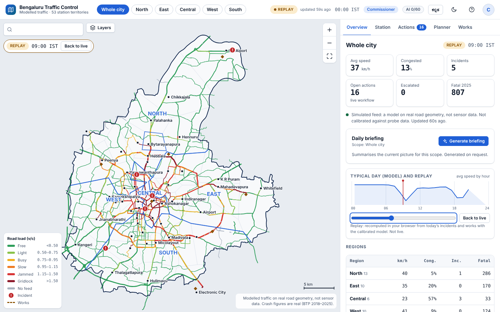 | 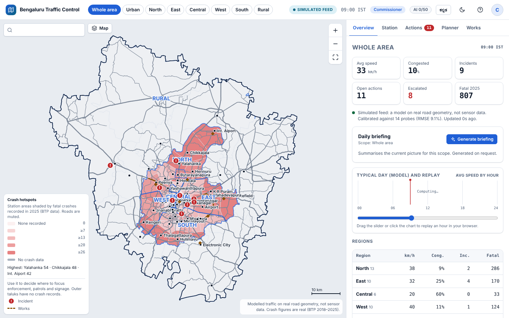 |
| **Live traffic** (default): whole area with Urban regions and Rural, KPIs, typical-day timeline and replay | **Crash hotspots**: station areas shaded by 2025 fatal crashes; legend says what the colours mean and what to do with them |
| 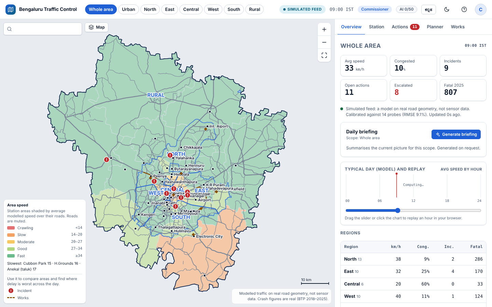 | 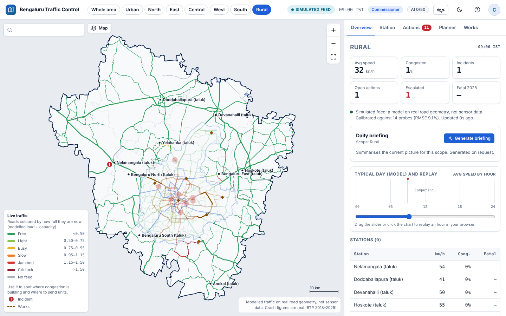 |
| **Area speed**: areas shaded by average modelled speed, slowest areas listed | **Rural scope**: outer taluk units and their roads, Urban dimmed; no crash data (shown as a dash) |
| 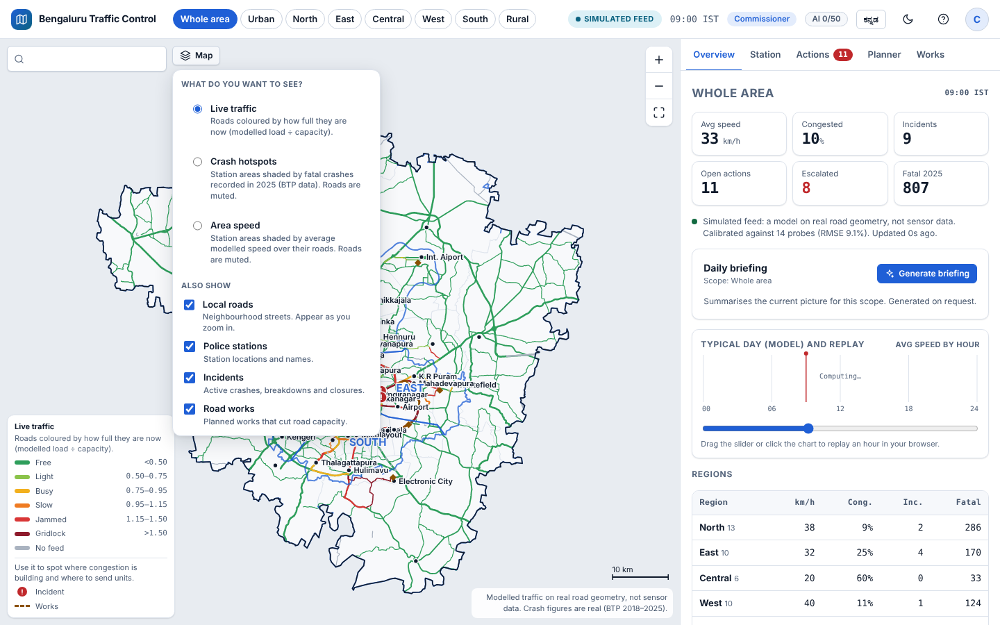 | 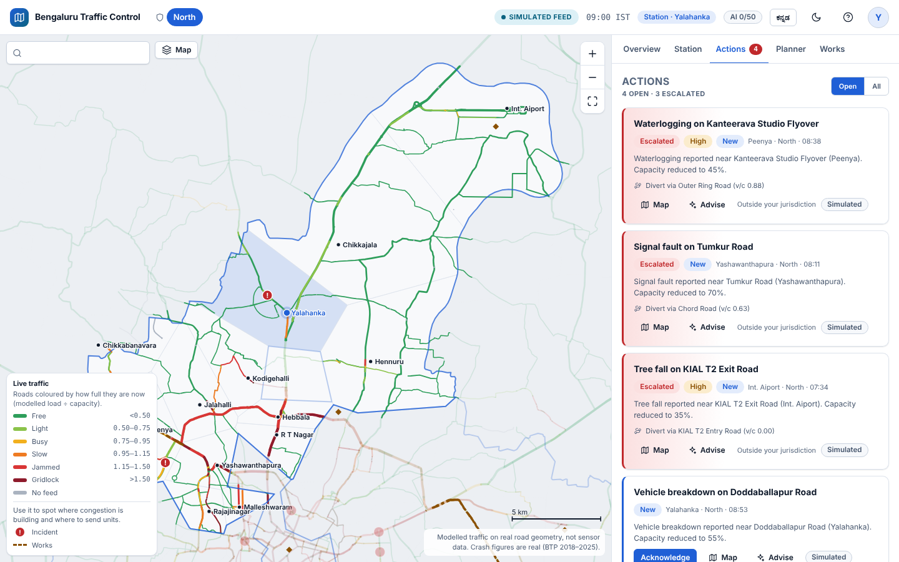 |
| **Map panel**: views and layers; only what the admin allows for your role appears | **Station user (Yalahanka)**: sees its region, own station highlighted |
| 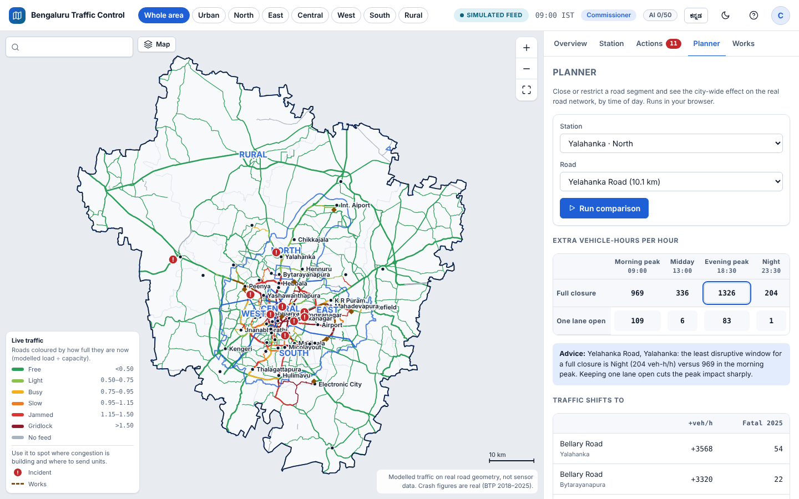 | 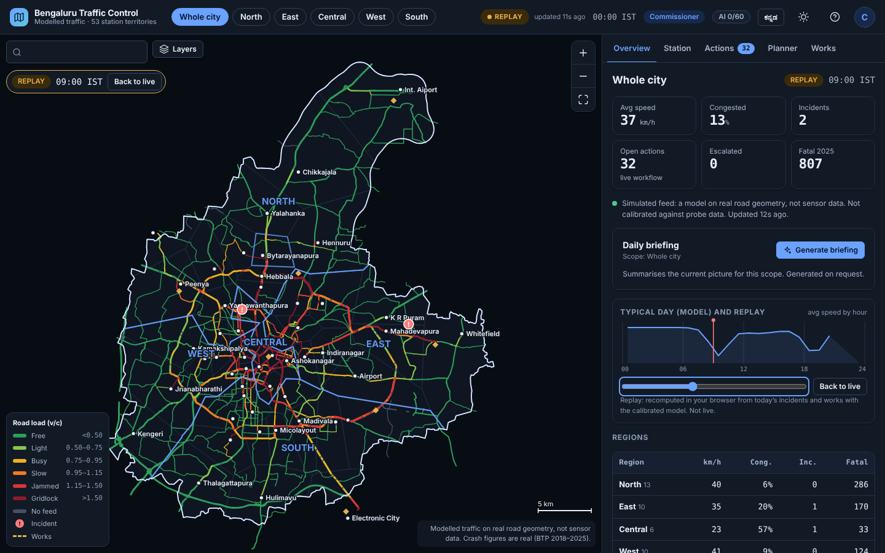 |
| **Planner**: closure impact by time of day, diversion shifts with crash history | **Dark theme** |
| 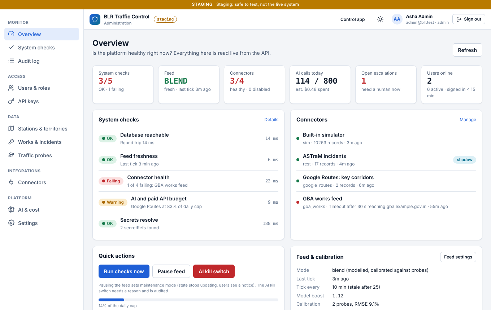 | 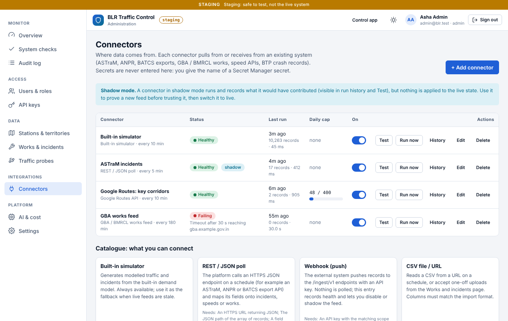 |
| **Admin overview**: system checks, connector health, feed and AI status | **Connectors**: REST, webhook, CSV, Google Routes, TomTom, GBA/BMRCL, OpenCity |
| 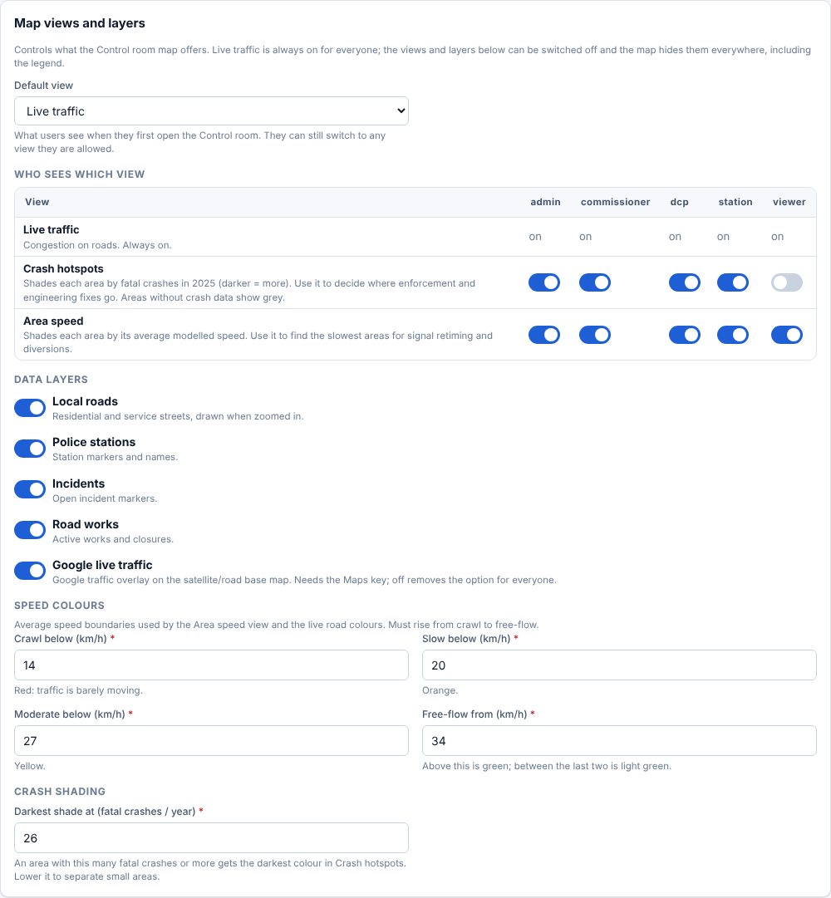 | 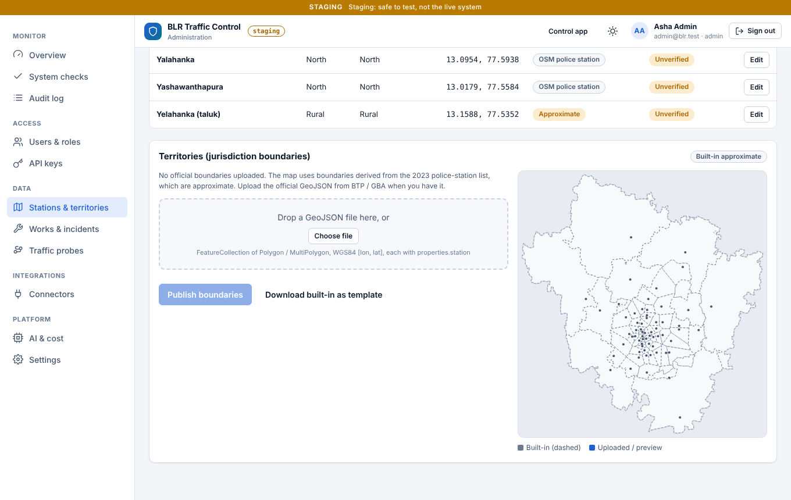 |
| **Settings, Map views and layers**: default view, per-role views, layers, speed thresholds | **Stations and territories**: coordinate overrides, official boundary upload |
| 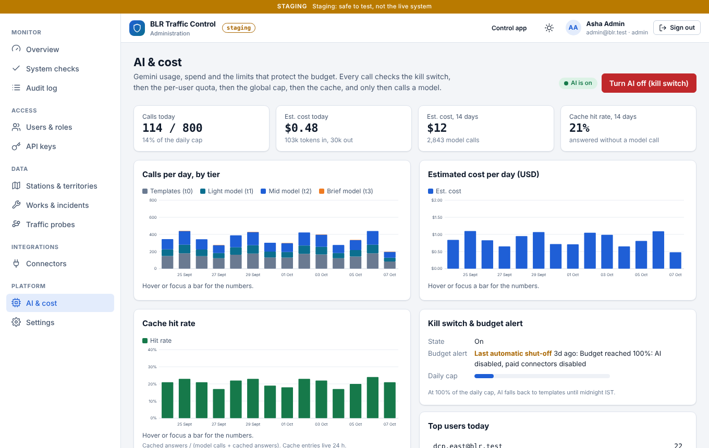 | 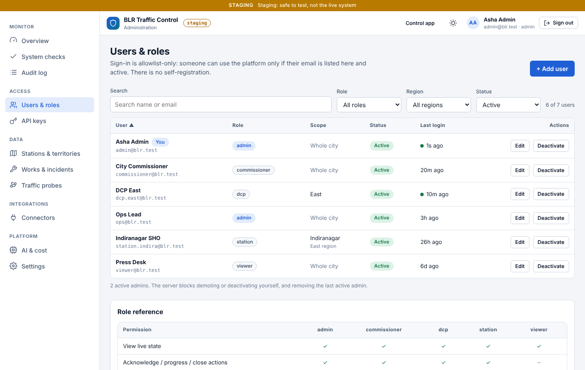 |
| **AI and cost**: calls by tier, spend, cache hit rate, kill switch | **Users and roles**: allowlist with region and station scope |

<p align="center">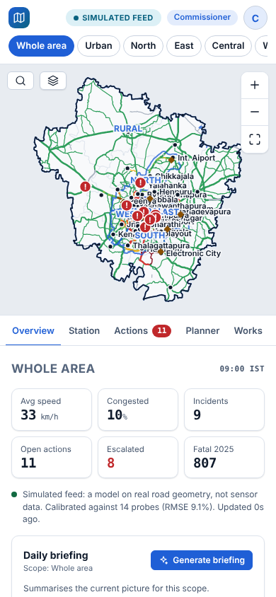</p>

## Architecture at a glance

Two static sites on Firebase Hosting (Control, Admin) call one Cloud Run API through hosting rewrites. A private Cloud Run worker, driven by Cloud Scheduler, runs the feed tick, system checks, retention and the budget kill switch. Firestore holds everything; Secret Manager holds connector credentials; Vertex AI serves Gemini. Details and diagram: [docs/architecture.md](docs/architecture.md).

## What is in the repo

| Path | Purpose |
|---|---|
| `apps/control` | Control room (static ES modules, canvas map). Commissioner, DCP, station, viewer views |
| `apps/admin` | Admin site: users, stations, connectors, probes, works, API keys, AI, system checks, audit, settings |
| `apps/api` | Fastify API on Cloud Run (`/api`, `/ingest/v1`) |
| `apps/worker` | Private Cloud Run worker (tick, checks, retention, budget kill switch) |
| `packages/model` | Traffic model: network, assignment, calibration, incidents |
| `packages/core` | Store (Firestore / in-memory), auth, connectors, AI router, ingest, checks |
| `packages/shared` | Roles, permissions, jurisdiction, workflow |
| `packages/ui` | Shared design system |
| `packages/mapdata`, `tools/mapdata` | Packaged map (`map.json`, crash data) and the Python pipeline that builds it from OpenStreetMap and KGIS (see [docs/data-sources.md](docs/data-sources.md)) |
| `infra/terraform` | All GCP resources |
| `scripts` | bootstrap, deploy, doctor, seed, set-secret, smoke, rollback, teardown |
| `docs` | Architecture, API contract, security, cost and AI, model, integration guide, runbook, data sources, roadmap |

## Run locally (no GCP needed)

```sh
npm ci
npm run dev        # builds both sites, starts the API with in-memory demo data
```

Control: `http://127.0.0.1:8080/`, Admin: `http://127.0.0.1:8080/admin/`. Pick a demo user on the dev sign-in screen (commissioner, DCP, station, viewer, admin). Dev auth is refused when `NODE_ENV=production`.

Checks: `npm test` (API, core, model, shared, worker), `npm test --prefix apps/control`, `npm test --prefix apps/admin` (Playwright, needs Chromium), `npm run lint`.

## Deploy to your own GCP project

You run these; no credentials ever go to anyone else.

1. Create a GCP project with billing. Install `gcloud`, `docker`, `terraform`, Node 22. `gcloud auth login` and `gcloud auth application-default login`.
2. In the console create a Google OAuth client (Identity Platform needs it; one manual step) and keep the client id and secret.
3. `cp infra/terraform/envs/dev.tfvars.example infra/terraform/envs/dev.tfvars` and fill in project, admin emails, OAuth client id, budget.
4. `scripts/bootstrap.sh --env dev --project <id> --github-repo <owner/name>` (state bucket, deployer service account, Workload Identity Federation for GitHub Actions).
5. `scripts/deploy.sh --env dev --project <id>` (Terraform, image build and push, Cloud Run, Hosting, smoke test).
6. `scripts/seed.sh --env dev --admin-email you@example.com` creates the first admin. Everything after that is done in the Admin site.
7. `scripts/doctor.sh --env dev` for a read-only health check.

Or deploy from GitHub Actions: set the GitHub environment variables `WIF_PROVIDER`, `WIF_SERVICE_ACCOUNT`, `TF_STATE_BUCKET` and `TFVARS` (the full contents of your tfvars file), then run **Deploy** (Terraform, images, Cloud Run, Hosting). **Deploy web only** publishes just the two static sites and runs automatically on pushes to `main` that touch them. Details in [docs/runbook.md](docs/runbook.md).

Details: [docs/runbook.md](docs/runbook.md). Costs and AI caps: [docs/cost-and-ai.md](docs/cost-and-ai.md). Every price in that page is an assumption to verify.

## Cost when idle

Cloud Run (API and worker) scales to zero. Cloud Scheduler still fires, but when nobody has used the app for two hours (Admin > Settings > Data feed, `Treat as idle after`) the worker ticks once an hour instead of every ten minutes and stops calling the paid APIs (Google Routes, TomTom). For a full stop set `scheduler_paused = true` in `TFVARS` and run Deploy. Per-day paid caps are in Admin > Settings. Details: [docs/runbook.md](docs/runbook.md), [docs/cost-and-ai.md](docs/cost-and-ai.md), [docs/architecture.md](docs/architecture.md).

## Access model

Google sign-in through Identity Platform, then an email allowlist in Firestore (`users/{email}`). Roles: `admin`, `commissioner` (whole area), `dcp` (one region), `station` (own station, sees region map), `viewer` (read only). Every check is enforced server-side; the UI only dims. See [docs/security.md](docs/security.md).

## AI and cost control

Tiered Gemini routing: t0 templates (no model), t1 cheapest model (short, Kannada), t2 mid (advice, clash narrative), t3 strongest (commissioner brief only, cached per scope and hour). Per-user quota, global daily cap, caches, kill switch, and a Pub/Sub billing-budget trigger that disables AI and paid connectors. Model ids are settings, not code.

## Connecting existing systems

Generic REST and webhook connectors, CSV upload, inbound `x-api-key` ingest, Google Routes and TomTom speeds, GBA/BMRCL works feeds, BTP crash records. See [docs/integration-guide.md](docs/integration-guide.md).

## Validation status

Verified here: unit tests (core 45, api 28, worker 5, model 6, shared 6), Control suite (38 tests incl. Playwright scenarios) and Admin suite (42 tests incl. Playwright scenarios) against mock and in-memory servers, repo lint, shellcheck, Terraform syntax parse.

CI (`.github/workflows/ci.yml`) also runs Terraform fmt/validate and container builds on GitHub; those were not run in the authoring sandbox.

**Not verified by automated tests:** `terraform plan/apply` results, real Firestore, Vertex AI, Secret Manager, Identity Platform, Cloud Scheduler OIDC, billing budget. Read the plan before the first apply. Open items before real operational use: independent VAPT, MFA enforced at the Google tenant, calibration against real probe data, native Kannada review, verification of approximate station coordinates (6 are approximate), confirmation that the Commissionerate's jurisdiction covers the outer taluks.

## Data and licences

Roads © OpenStreetMap contributors (ODbL), taluk boundaries from KGIS (Karnataka GIS), crash data from BTP via OpenCity, see [docs/data-sources.md](docs/data-sources.md). Code is released under the licence in [LICENSE](LICENSE).
