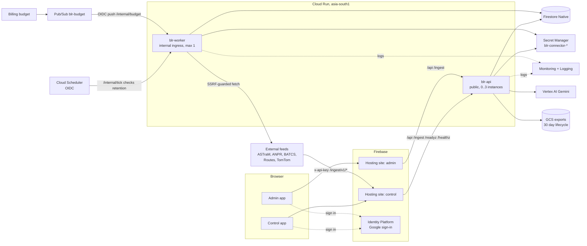
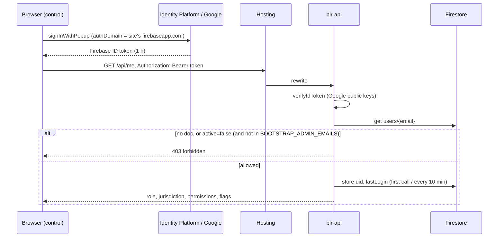
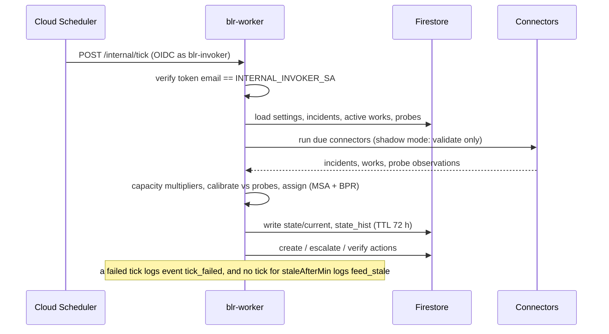

# Architecture

Bengaluru Traffic Control Room: a modelled live congestion map (Urban city plus outer taluks) with role-scoped operations and admin-controlled map views. Sized for a proof of concept (about 10 to 200 users) and built to cost close to nothing when idle. The HTTP contract is in [api-contract.md](api-contract.md); this page covers the deployed system.

## Components

Same-origin by design: each Hosting site rewrites `/api/**`, `/ingest/**`, `/healthz`, `/readyz` to `blr-api`, so the browser never makes a cross-origin call and there is no CORS configuration to get wrong.

| Component | Responsibility | Notes |
|---|---|---|
| Firebase Hosting (2 sites) | Static control and admin apps, security headers, CSP, rewrites to the API | `firebase.json`; `/vendor` and `/assets` revalidate hourly (names are not hashed); `index.html` and `config.js` are `no-cache` |
| Identity Platform | Google sign-in only; issues Firebase ID tokens | Authentication only. Authorisation is the `users/{email}` allowlist in the API |
| `blr-api` (Cloud Run) | Verifies ID tokens, enforces roles and jurisdiction, serves state, actions, admin, AI, ingest | Public ingress (Hosting cannot attach identity tokens), 1 vCPU / 512 MiB, concurrency 80, min 0, max 3 (variable) |
| `blr-worker` (Cloud Run) | Tick (connectors, model, actions), checks, retention, budget kill switch | Ingress internal; only the invoker service account may call it; max 1 instance so ticks never overlap |
| Firestore (Native, single DB) | All state. Clients have no access (`firestore.rules` denies all) | TTL on `expireAt`; composite indexes in `firestore.indexes.json` |
| Cloud Scheduler | `tick` (10 min in the day window, hourly otherwise), `checks` (15 min), `retention` (nightly) | Cron in `Asia/Kolkata`; the day window is split into 3 jobs because cron cannot start at :30 |
| Secret Manager | Connector credentials `blr-connector-<id>` | Written only by `scripts/set-secret.sh`; runtime SAs can read that prefix only |
| Vertex AI | Gemini tiers t1 to t3 | No API key; runtime service account has `roles/aiplatform.user` |
| Pub/Sub `blr-budget` | Billing budget notifications to the worker | Push with OIDC; the worker disables AI and paid connectors at 100 percent |
| GCS bucket | Exports and uploads | Uniform access, public access prevention enforced, 30 day lifecycle |
| Artifact Registry `blr` | Container images tagged with the commit SHA | Cleanup keeps the 10 newest versions |
| Cloud Monitoring | Log-based metrics, alert policies, `/readyz` uptime check | Email channel from `alert_email` |

## Request flows

### Sign-in

Anyone with a Google account can obtain a token; only allowlisted emails get past `/api/me`. Disabling a user takes effect within about 60 seconds (in-process user cache).

### Live tick

The state is modelled. Even in `live` mode it is a model calibrated against probe observations, not a sensor feed; the UI must say so ([model.md](model.md)).

### Action workflow

`new` to `ack` to `prog` to `done`; `done` and `persist` can return to `prog`. The worker, not users, sets `cleared` or `persist` after `verifyAfterMin` by re-checking the edge's volume/capacity ratio (congestion actions, persists at 0.9 or above) or whether the incident or work is still active, and sets `escalated` (priority `hi`) on actions still `new` after `escalateAfterMin`.

1. Browser: `POST /api/actions/:id/transition {to}`.
2. API checks the `action.transition` permission and that the action's station is in the caller's jurisdiction (admin and commissioner: all; dcp: region; station: own station; viewer: none).
3. API validates the transition against the state machine (illegal gives 409), updates the action, writes an `audit` row.
4. Next tick: the worker verifies `done` actions older than `verifyAfterMin` against fresh state.

### What-if planner

Runs entirely in the browser: the same `@blr/model` module as the server, executed in a Web Worker on the downloaded `map.json`. The server is involved only to supply current state and works. Requires the `planner.run` permission; nothing is written.

## Control app: map data, scopes, views

- **Map data.** `/assets/map.json` (from `packages/mapdata`, about 6.8 MB, about 2.1 MB over the wire with Hosting compression) holds 62 areas (53 police-station territories and 9 outer taluk units), about 15,000 routable segments (classes 0 to 2) and about 117,000 draw-only segments (tertiary, unclassified and class 4 residential streets). Every browser downloads it once per version; the model, replay and planner run on it client-side. The per-edge state in `state/current` is indexed by the routable segments only.
- **Rendering.** One canvas. Classes 0 to 2 always; class 3 once zoomed in a little and class 4 residential streets once zoomed in further (both controlled by the Local roads layer). The canvas redraws on state, scope, view and zoom changes.
- **Scopes.** `All` (whole area), `Urban` (the five regions together), one of North, East, Central, West, South, or `Rural` (the 9 outer units). A scope filters the KPIs, tables and the briefing; the map dims what is out of scope. Station and DCP users stay locked to their region by the server, not by the UI.
- **Views.** Live traffic (road colours from the model), Crash hotspots (area shading from `/api/crash`) and Area speed (area shading from modelled speed). Which views and layers exist for a role, the default view and the thresholds come from `settings.map`, delivered in `GET /api/me`; the Control app re-reads `/me` about every 4 ticks, so an Admin change reaches open sessions within minutes without a deploy. This is a presentation control, not an access boundary: `/api/crash` and `/api/state` are readable by every signed-in role, so hiding a view does not hide its data. Writes and jurisdiction are still enforced by the API.

## Runtime configuration contract

Non-secret environment, set by Terraform (`main.tf`, `common_env` and `api_env`). Code reads these names.

| Variable | Service | Meaning |
|---|---|---|
| `NODE_ENV=production` | both | Enables production guards; `AUTH_MODE=dev` is refused |
| `GOOGLE_CLOUD_PROJECT`, `GCP_PROJECT`, `GCP_REGION` | both | Project and region |
| `BOOTSTRAP_ADMIN_EMAILS` | api (and worker checks) | Comma list of emergency admins |
| `INTERNAL_INVOKER_SA` | both | Only OIDC tokens from this email may call `/internal/*` |
| `EXPORT_BUCKET` | both | GCS bucket for exports |
| `SECRET_PREFIX` | both | `blr-connector-` |
| `VERTEX_LOCATION`, `AI_MODEL_T1`, `AI_MODEL_T2`, `AI_MODEL_T3` | both | Gemini location and default model ids (admins can change tier models at runtime in `settings/app`) |
| `PORT` | both | Set by Cloud Run (8080) |

`GCP_PROJECT`, `GCP_REGION`, `EXPORT_BUCKET` and `SECRET_PREFIX` are set by infra but not yet read by the current code (it uses `GOOGLE_CLOUD_PROJECT`, and reads secrets by the full name in `secretRef`); they are harmless and reserved for the export feature.

## Log events

Monitoring counts structured log lines whose `event` (or `msg`) field equals one of these. The worker must emit them.

| Event | Emitted when | Alert |
|---|---|---|
| `tick_failed` | A tick throws or exceeds its budget | BLR tick failure |
| `feed_stale` | No successful tick within `settings.feed.staleAfterMin` | BLR feed stale |
| `ai_kill` | Admin flips the AI kill switch | BLR AI kill / budget kill |
| `budget_kill` | Budget message reached 100 percent | BLR AI kill / budget kill |

5xx alerting needs no code: it uses Cloud Run request logs.

## Data layout

Collections and shapes: [api-contract.md](api-contract.md). Operational facts:

| Collection | TTL (`expireAt`) | Written by |
|---|---|---|
| `state/current` | none (overwritten) | worker |
| `state_hist` | 72 h | worker |
| `connector_runs` | 14 d | worker, API (run now) |
| `probe_obs` | 7 d | worker, `/ingest/v1/speeds` |
| `ai_cache` | 24 h | API |
| `counters` | 3 d | connectors (daily call caps) |
| `checks` | 60 s (probe docs) | checks |
| `audit`, `actions`, `incidents`, `works`, `users`, `settings`, `crash_stats`, `connectors`, `probes`, `apikeys`, `ai_usage` | none | API / worker |

Deployed with Terraform: the database and TTL policies. Deployed with the Firebase CLI (`scripts/deploy.sh`, `deploy.yml`): `firestore.rules` and `firestore.indexes.json`.

## Environments

One GCP project per environment (`dev`, `prod`) with the same Terraform and a different `tfvars`. Terraform state lives in `gs://<project>-tfstate`. Terraform owns the shape of the Cloud Run services; the pipeline owns the image (`ignore_changes` on image, labels and traffic), so `terraform apply` never reverts a deploy or a rollback.
